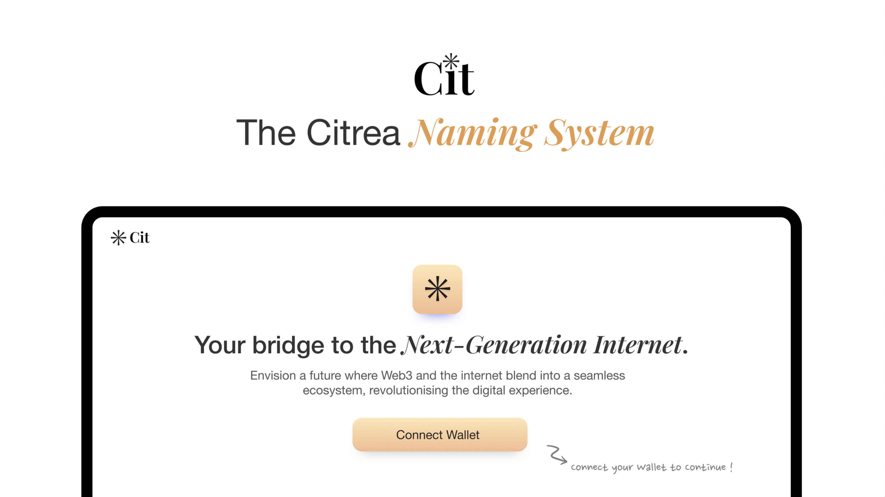

# Cit

Cit is the **Citrea Naming Service.**



## Steps to Claim your `.cit` name

### If you have ENS name set on your EVM address

Just call the [`registerWithoutFee` function](https://github.com/megabyte0x/encode_bitcoin/blob/dcb8049e908f7934c012b204b0befb7d0ed54fca/contracts/src/Payment.sol#L56) on the [Payment contract.](https://explorer.testnet.citrea.xyz/address/0xba4C071bb83dCC799311b7BF1077D837212FeA3d?tab=write_contract#e67349f7) 

Parameters:
1. You will need to pass your EVM wallet address. 
2.  `namehash` of your name.
    For Example: If you have `megabyte.cit` name, then run the following script to get the namehash of your name.
    ```javascript
    const ethers = require('ethers');

    const name = 'megabyte.cit';
    const namehash = ethers.namehash(name);
    console.log(namehash);
    ```
3. URI your token is pointing to. Following the [NFT metadata standard.](https://github.com/ethereum/ercs/blob/master/ERCS/erc-721.md)

### If you don't have ENS name set on your EVM address

You will need to call the [`registerWithFee` function](https://github.com/megabyte0x/encode_bitcoin/blob/dcb8049e908f7934c012b204b0befb7d0ed54fca/contracts/src/Payment.sol#L47) on the [Payment contract](https://explorer.testnet.citrea.xyz/address/0xba4C071bb83dCC799311b7BF1077D837212FeA3d?tab=write_contract#f20d79f7) and pay *0.005 cBTC as one time fee.*

Parameters:
1. You will need to pass your EVM wallet address.
2. `namehash` of your name.
    For Example: If you have `megabyte.cit` name, then run the following script to get the namehash of your name.
    ```javascript
    const ethers = require('ethers');

    const name = 'megabyte.cit';
    const namehash = ethers.namehash(name);
    console.log(namehash);
    ```
3. URI your token is pointing to. Following the [NFT metadata standard.](https://github.com/ethereum/ercs/blob/master/ERCS/erc-721.md)


## Contracts on Citrea Testnet

### Cit
[0x6C27b8604e7DAe0D7e319a9C45006BAd71EaB7a9](https://explorer.testnet.citrea.xyz/address/0x6C27b8604e7DAe0D7e319a9C45006BAd71EaB7a9)

This is the ERC721 contract for `.cit` names.

### Registry 
[0x9846575bB1185D42C7A2AafB6963ED5bcc02670e](https://explorer.testnet.citrea.xyz/address/0x9846575bB1185D42C7A2AafB6963ED5bcc02670e)

This is regsitry for the `.cit` names, storing the owners with respect to the tokenId and vice versa.

### Payment
[0xba4C071bb83dCC799311b7BF1077D837212FeA3d](https://explorer.testnet.citrea.xyz/address/0xba4C071bb83dCC799311b7BF1077D837212FeA3d)

This is the contract for handling the payments for `.cit` names and interacting with frontend. 
